# Manual de usuario — Perfil Abastible

> Guía paso a paso de la app **Nota de Venta Abastible** para el perfil **🏢 Abastible**
> (supervisores, jefes de proyecto, coordinadores y personal comercial). Todas las
> capturas de este manual son de la app real, usando datos de ejemplo ficticios.

Si sos **Contratista (empresa externa)**, usá [MANUAL_CONTRATISTA.md](MANUAL_CONTRATISTA.md) en su lugar.

## Índice

1. [Ingreso y selección de perfil](#1-ingreso-y-selección-de-perfil)
2. [Elegir qué documento crear](#2-elegir-qué-documento-crear)
3. [Nota de Venta](#3-nota-de-venta)
4. [Cargar DC (PDF)](#4-cargar-dc-pdf)
5. [Análisis DC + Cotización](#5-análisis-dc--cotización)
6. [Historial de Notas](#6-historial-de-notas)
7. [Acciones del documento final](#7-acciones-del-documento-final)
8. [Preguntas frecuentes](#8-preguntas-frecuentes)

---

## 1. Ingreso y selección de perfil

Al abrir la app se pide elegir el perfil. Seleccioná **🏢 Abastible**.

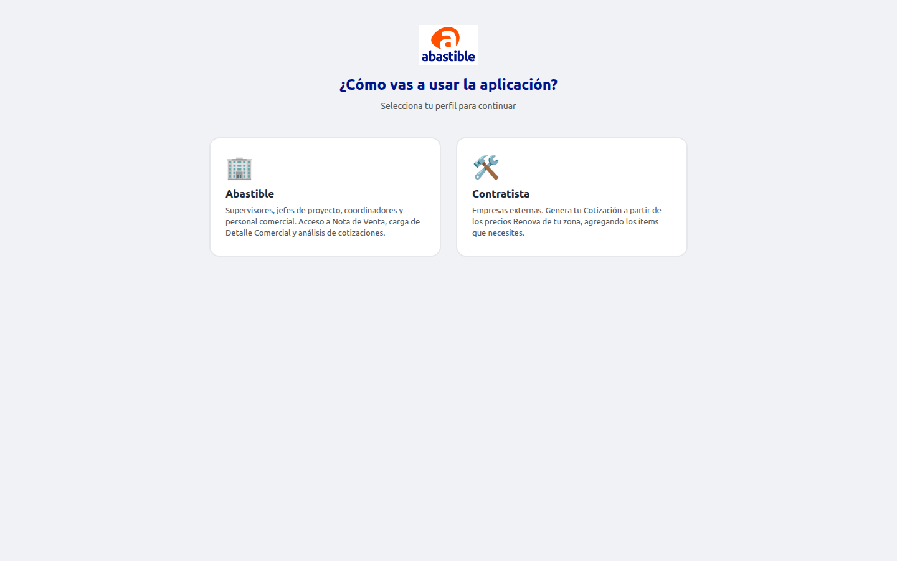

A diferencia del perfil Contratista, Abastible no pide datos de empresa: pasa directo
a la pantalla de selección de documento.

## 2. Elegir qué documento crear

Hay tres opciones. Cada una arranca un flujo distinto:

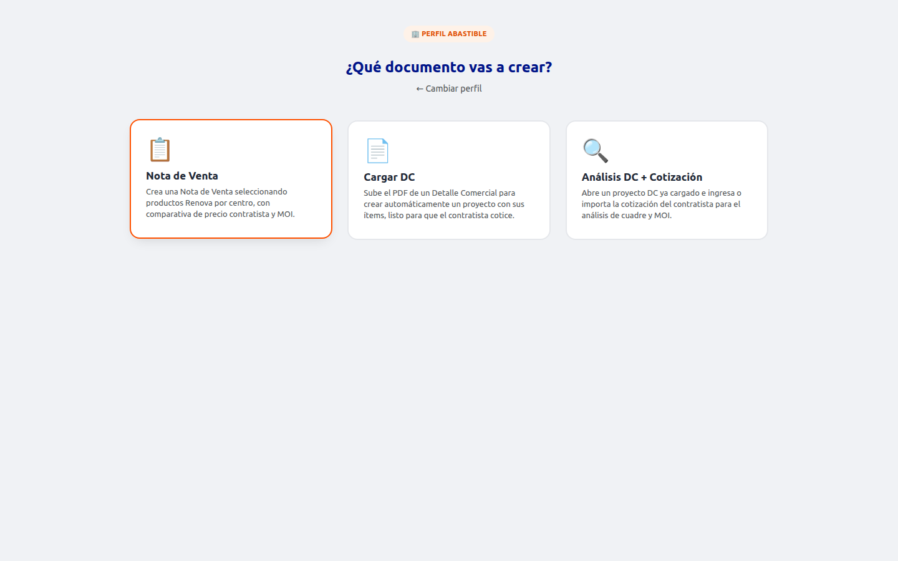

| Opción | Para qué sirve |
|---|---|
| **📋 Nota de Venta** | Armar una Nota de Venta manualmente, eligiendo productos Renova por centro. |
| **📄 Cargar DC** | Subir el PDF de un Detalle Comercial para crear automáticamente un proyecto con sus ítems, listo para que el contratista cotice. |
| **🔍 Análisis DC + Cotización** | Cruzar un DC (o un presupuesto/cotización de contratista) contra los precios Renova y calcular el cuadre con MOI. |

## 3. Nota de Venta

### 3.1 Paso 1 — Datos del proyecto

Al entrar, si la base de productos Renova todavía no está cargada, aparece un aviso y
el botón **📂 Cargar Base Excel** (en el sitio publicado por Vercel la base se carga
sola; el botón manual solo aparece como respaldo si ese auto-fetch falla).

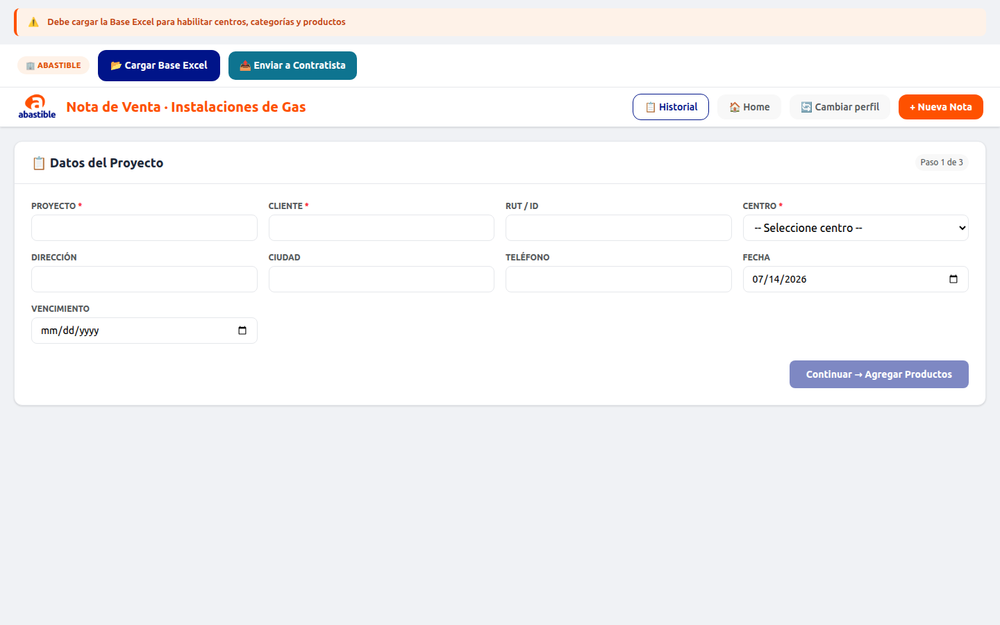

Completá **Proyecto**, **Cliente** y **Centro** (obligatorios — el Centro define qué
precios Renova se van a usar) y, si corresponde, RUT/ID, Dirección, Ciudad, Teléfono,
Fecha y Vencimiento.

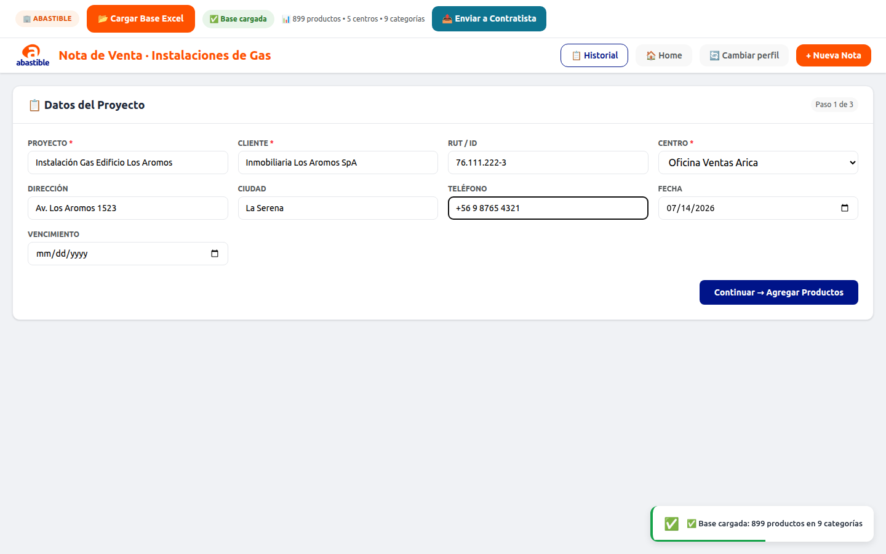

Click en **Continuar → Agregar Productos**.

### 3.2 Paso 2 — Agregar productos

A la izquierda están las **categorías** de la base Renova; al hacer click en una se
listan sus productos a la derecha. Click en **+ Agregar** suma el producto a la nota
(o **click directo en la fila**, según la categoría).

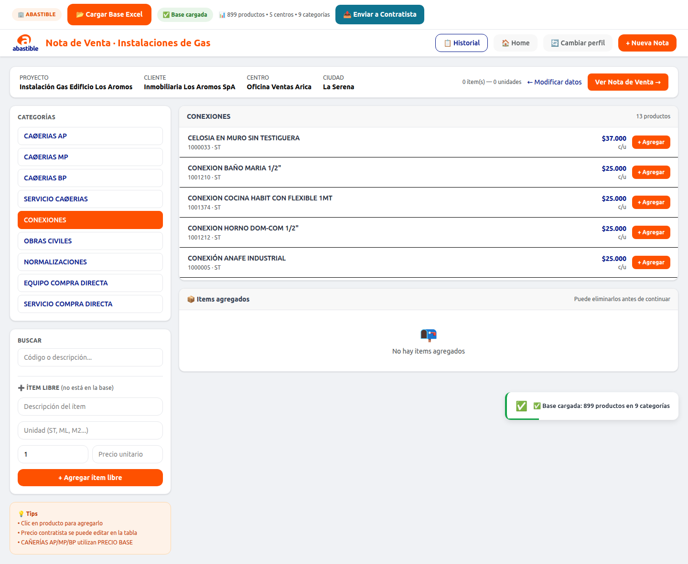

- Las categorías **CAÑERIAS AP/MP/BP** usan **PRECIO BASE** y, al agregarlas, suman
  automáticamente el material Impovar vinculado (metraje = cantidad + 5%, redondeado a
  tiras de 6 ML).
- Se puede buscar por código o descripción, o agregar un **ítem libre** (que no está en
  la base) indicando descripción, unidad, cantidad y precio.
- Los ítems agregados se listan abajo y se pueden eliminar antes de continuar.

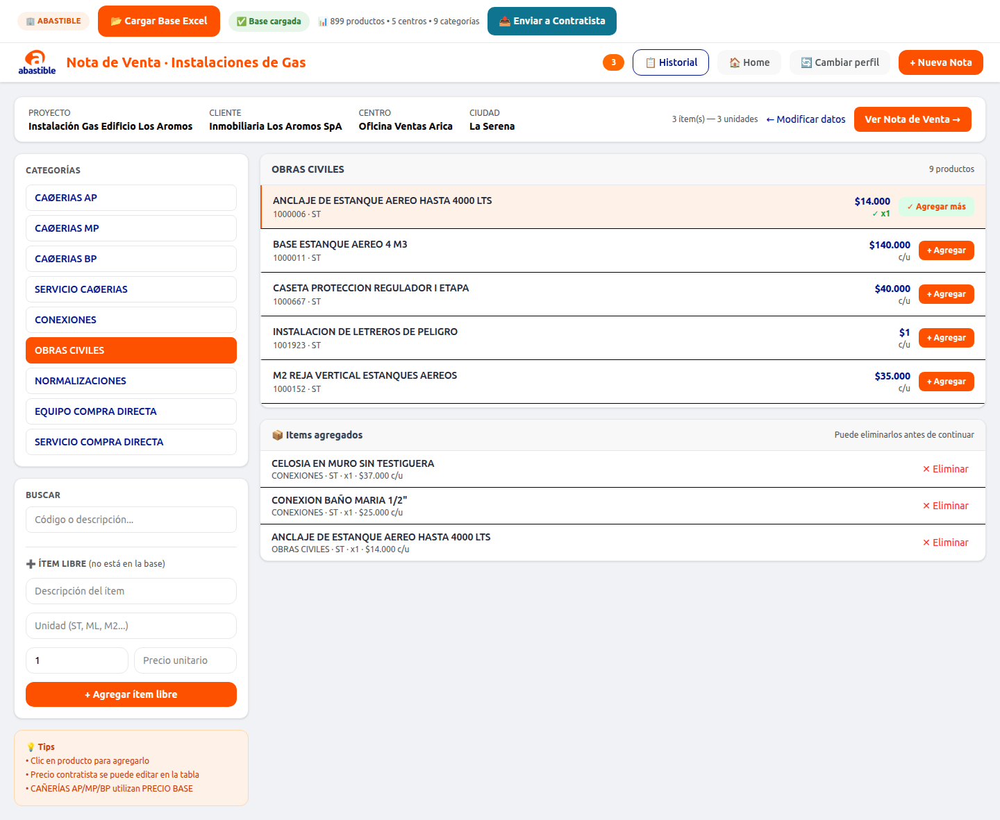

Click en **Ver Nota de Venta →**.

### 3.3 Paso 3 — Documento final

Se muestra la Nota de Venta con el detalle por categoría (Precio Renova, Cantidad,
Total) y el resumen final.

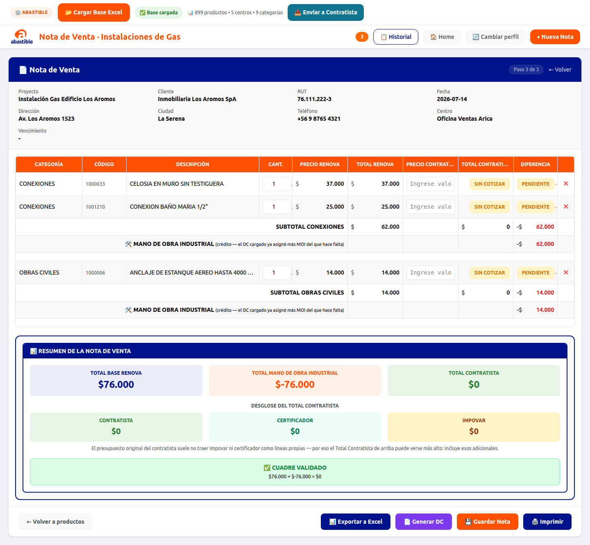

Desde acá se puede **Exportar a Excel**, **Generar DC**, **Guardar Nota** o
**Imprimir** (ver [sección 7](#7-acciones-del-documento-final)). En modo Nota de Venta
también aparece en la barra superior el botón **📤 Enviar a Contratista**, que descarga
un `.json` con el proyecto para que el contratista lo abra con **Cargar Cotización** en
su perfil y ponga sus precios.

## 4. Cargar DC (PDF)

Sirve para partir de un **Detalle Comercial en PDF** ya emitido: la app lo analiza con
IA (puede tardar hasta 1-2 minutos), extrae automáticamente proyecto, cliente, ciudad,
dirección e ítems, y arma la Nota de Venta lista para que el contratista cotice.

Pasos:
1. Elegir la tarjeta **📄 Cargar DC** en la pantalla de selección de documento —
   se abre el explorador de archivos automáticamente.
2. Seleccionar el PDF del Detalle Comercial.
3. Revisar la vista previa que trae la app (ítems detectados, categoría, MOI,
   certificador) y click en **Cargar como Nota de Venta**.
4. Si el DC trae MOI de certificador pero ningún ítem código 400 real, la app pregunta
   el monto de la certificación antes de continuar (en vez de asumir un valor fijo).
5. Queda armada la Nota de Venta (Paso 3), lista para exportar o enviar al contratista.

## 5. Análisis DC + Cotización

Esta es la pantalla central para **cuadrar** lo que cotizó un contratista contra los
precios Renova. Ofrece 4 vías de entrada, según de dónde partís:

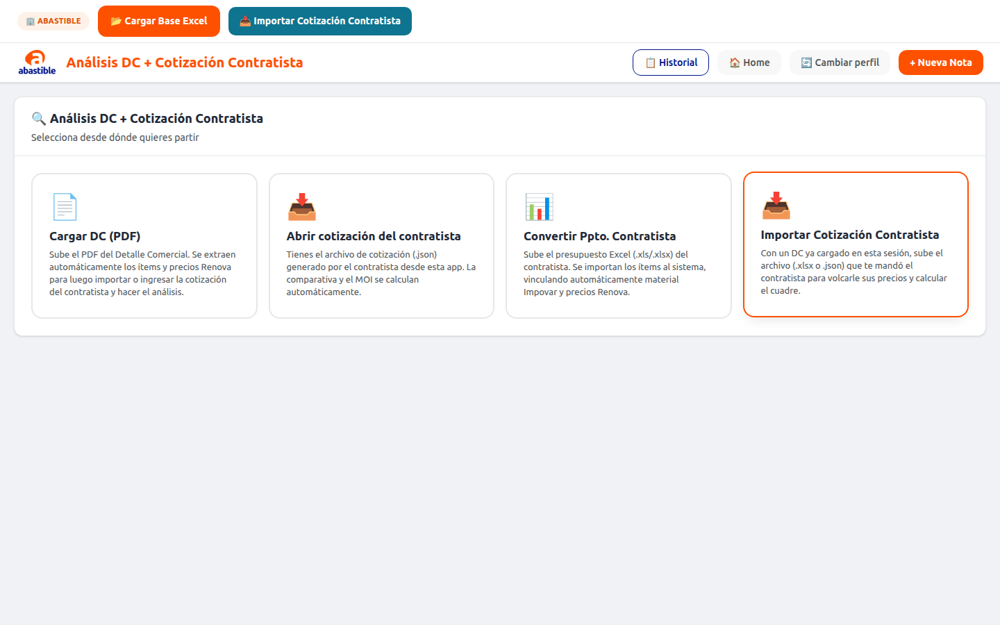

| Tarjeta | Cuándo usarla |
|---|---|
| **📄 Cargar DC (PDF)** | Partís de cero con el PDF del Detalle Comercial (igual que en la [sección 4](#4-cargar-dc-pdf)), y después ingresás o importás la cotización del contratista para el análisis. |
| **📥 Abrir cotización del contratista** | El contratista ya te mandó el archivo **`.json`** que generó con **Guardar Cotización** desde su perfil. Se abre directo en el análisis (Paso 3), sin pasos intermedios. |
| **📊 Convertir Ppto. Contratista** | El contratista te mandó su presupuesto en **Excel** (.xls/.xlsx), con cualquier formato propio. Ver detalle abajo. |
| **📥 Importar Cotización Contratista** | Ya tenés un DC cargado en esta sesión y el contratista te mandó sus precios en Excel o JSON: se vuelcan sobre los ítems ya cargados. |

### 5.1 Convertir Ppto. Contratista — flujo detallado

Es la forma más común de partir cuando el contratista no usa la app, sino que manda su
propio Excel de presupuesto (columnas mínimas: **Descripción**, **Cant.**, **Precio**;
opcionales: Ítem, Unidad, Subtotal, Categoría).

1. Click en la tarjeta **Convertir Ppto. Contratista** y seleccionar el Excel.
2. La app clasifica cada ítem automáticamente:
   - **Cañerías**: solo entran a CAÑERIAS AP/MP/BP los ítems cuya descripción habla de
     cañería/instalación/red GLP **y** trae diámetro. El match contra Renova es **por
     diámetro + familia de presión** (nunca por texto literal, porque cada contratista
     describe distinto). El material Impovar se vincula solo.
   - **Resto de ítems**: match exacto o por similitud de palabras clave.
   - **Sin match**: quedan como ítem libre con precio Renova **$0** — su valor se
     refleja después como MOI de su categoría (no se pierde).
3. Si al proyecto le falta Cliente o Centro, la app te pide completarlos (el nombre de
   Proyecto se propone solo, a partir del nombre del archivo):

   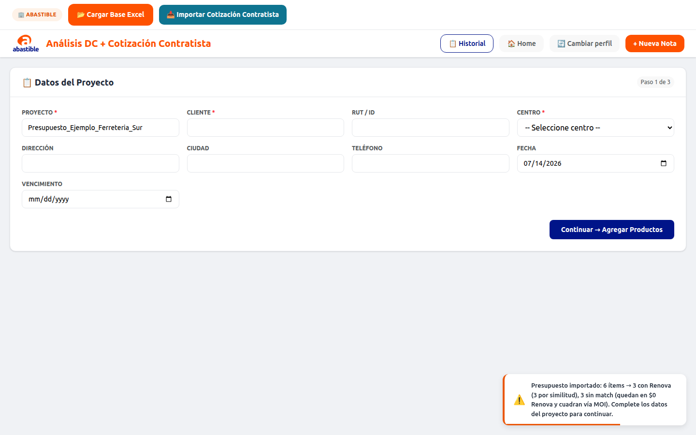

4. Al continuar, se abre el Paso 2 con los ítems ya importados y clasificados por
   categoría — se pueden revisar, corregir matches por similitud, o agregar/eliminar
   ítems antes de seguir:

   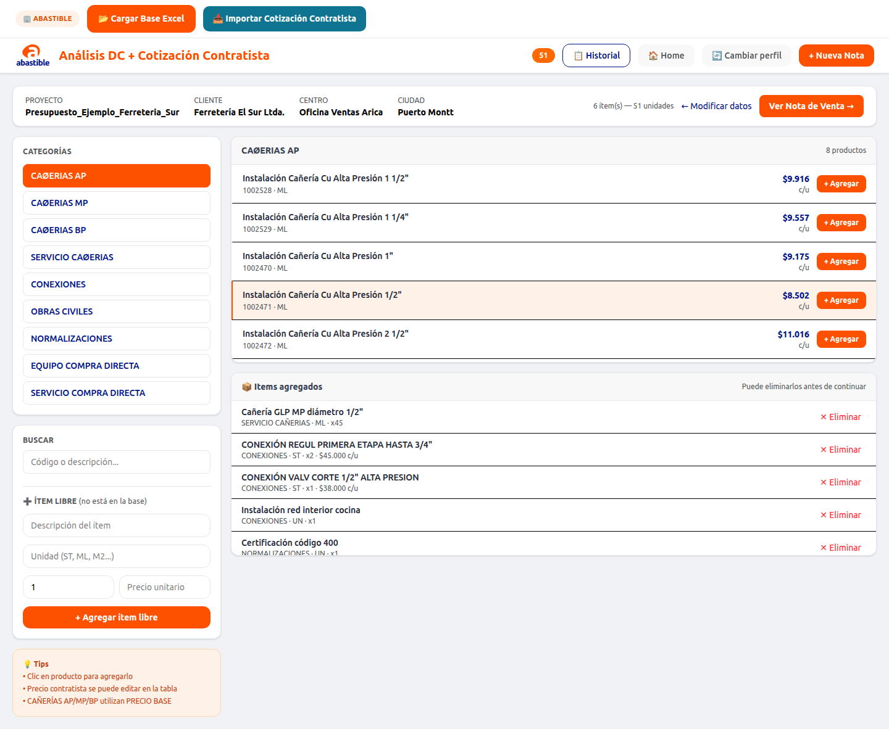

5. Click en **Ver Nota de Venta →** para llegar al análisis de cuadre.

### 5.2 El análisis de cuadre

El Paso 3 en modo Análisis muestra, por categoría, el Total Renova vs. el Total
Contratista, con **Mano de Obra Industrial (MOI)** calculada como la diferencia, y un
sello de validación al pie:

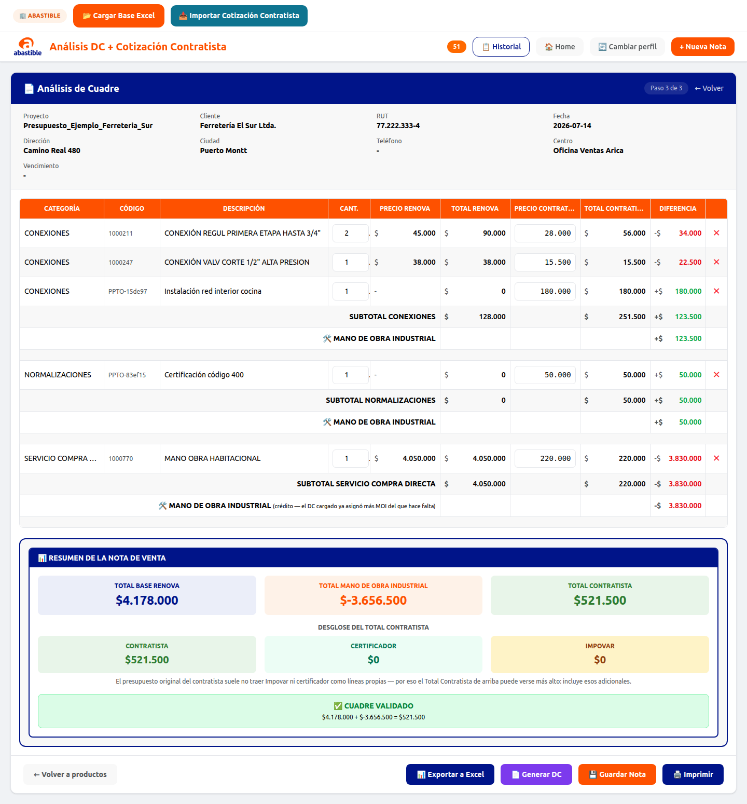

- **Total Base Renova + Total MOI = Total Contratista**, con el sello
  **✅ CUADRE VALIDADO**.
- Los ítems con código `PPTO-…` son los que no matchearon con Renova (precio Renova
  $0): su valor completo queda absorbido en el MOI de su categoría.
- Al exportar a Excel (ver [sección 7](#7-acciones-del-documento-final)), esa misma
  vista se convierte en la **guía de digitación** para crear el DC — con la columna
  **"DIGITAR EN DC"** indicando qué filas cargar y cuáles no (para no duplicar el
  valor que ya está sumado en el MOI).

## 6. Historial de Notas

El botón **📋 Historial** (solo disponible para Abastible, no para Contratista) lista
las notas guardadas con **💾 Guardar Nota**, combinando lo guardado en este navegador
(localStorage) con el respaldo en la nube (best-effort). Desde ahí se puede
**Cargar** una nota para seguir editándola o **Eliminar** una que ya no sirve.

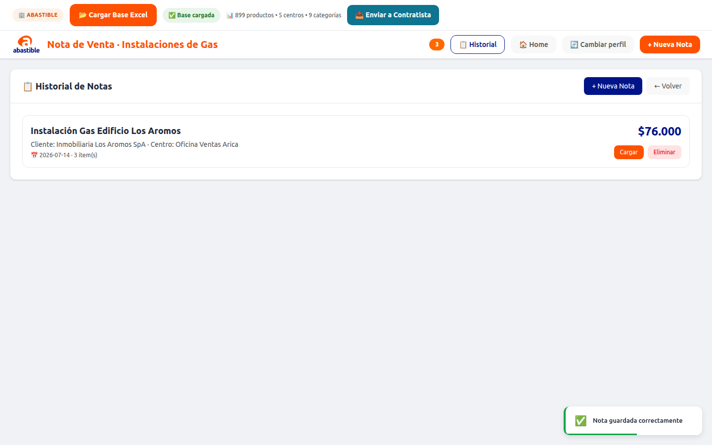

## 7. Acciones del documento final

Estos botones aparecen al pie del Paso 3 (Nota de Venta / Análisis de Cuadre):

- **📊 Exportar a Excel** — descarga `NOTA_VENTA_<proyecto>.xlsx` con el detalle
  completo (categoría, código, descripción, precio Renova, total, y en modo análisis
  también precio/total contratista, diferencia y la columna guía "DIGITAR EN DC").
- **📄 Generar DC** — solo visible para Abastible (nunca para Contratista): genera
  `DC_<proyecto>.xlsx` con la hoja lista en formato Operación/Código/Descripción/UN/
  Cant./Valor Unit./Valor Final/Proveedor.
- **💾 Guardar Nota** — guarda la nota en el Historial (local + respaldo en la nube).
- **🖨️ Imprimir** — imprime el documento tal como se ve en pantalla.
- **📤 Enviar a Contratista** (solo en modo Nota de Venta) — descarga el `.json` del
  proyecto para que el contratista lo abra con **Cargar Cotización**.

## 8. Preguntas frecuentes

**¿Por qué no aparecen productos en el Paso 2?**
Falta cargar la base de productos Renova. En el sitio publicado (https) se carga sola
al abrir la app; si falla, usar el botón **📂 Cargar Base Excel** y elegir
`base_datos.xlsx`.

**¿Cuál es la diferencia entre "Nota de Venta" y "Análisis DC + Cotización"?**
"Nota de Venta" es para armar un documento desde cero, eligiendo productos vos mismo.
"Análisis DC + Cotización" es para **cuadrar** un DC o presupuesto/cotización de un
contratista contra los precios Renova, con el desglose de MOI.

**¿Qué le mando al contratista para que cotice?**
Un `.json` generado con **Enviar a Contratista** (desde una Nota de Venta) o
directamente el PDF del DC. El contratista lo abre desde su perfil con
**Cargar Cotización** o **Cotizar sobre DC** — ver
[MANUAL_CONTRATISTA.md](MANUAL_CONTRATISTA.md).
