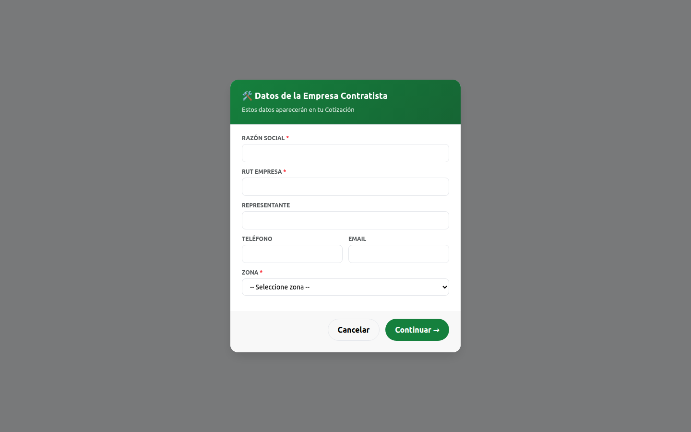
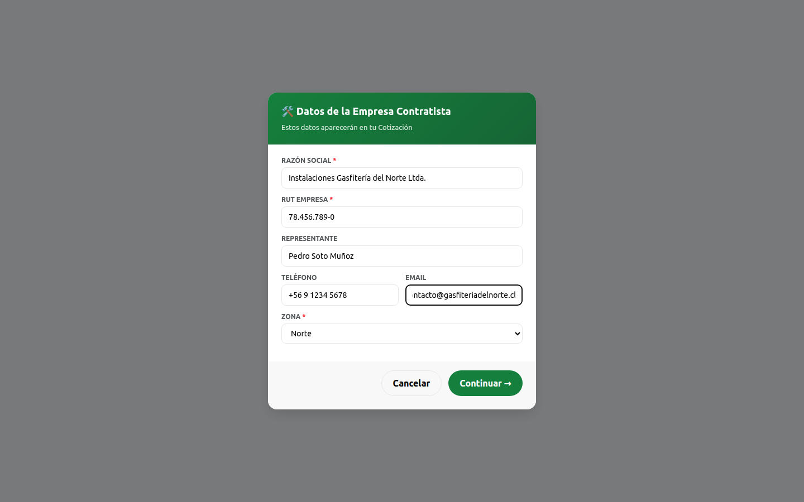
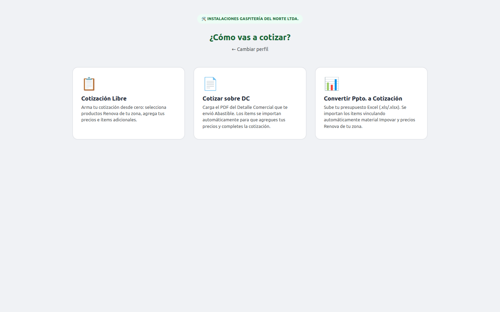
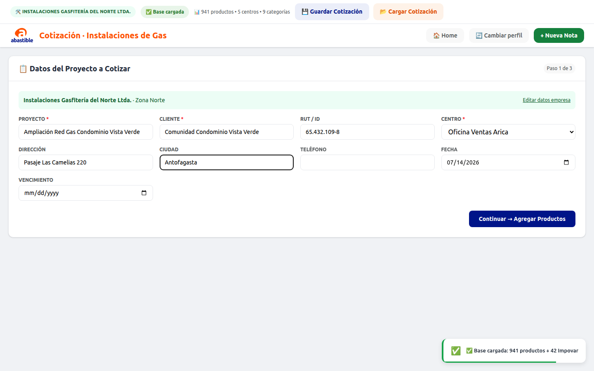
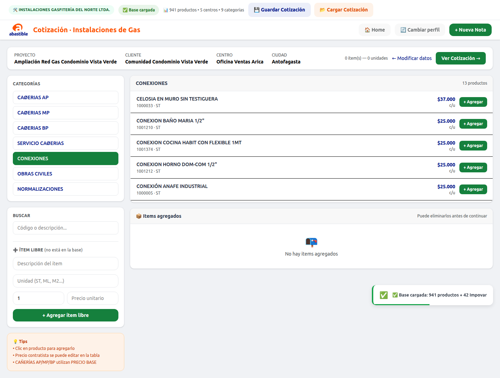
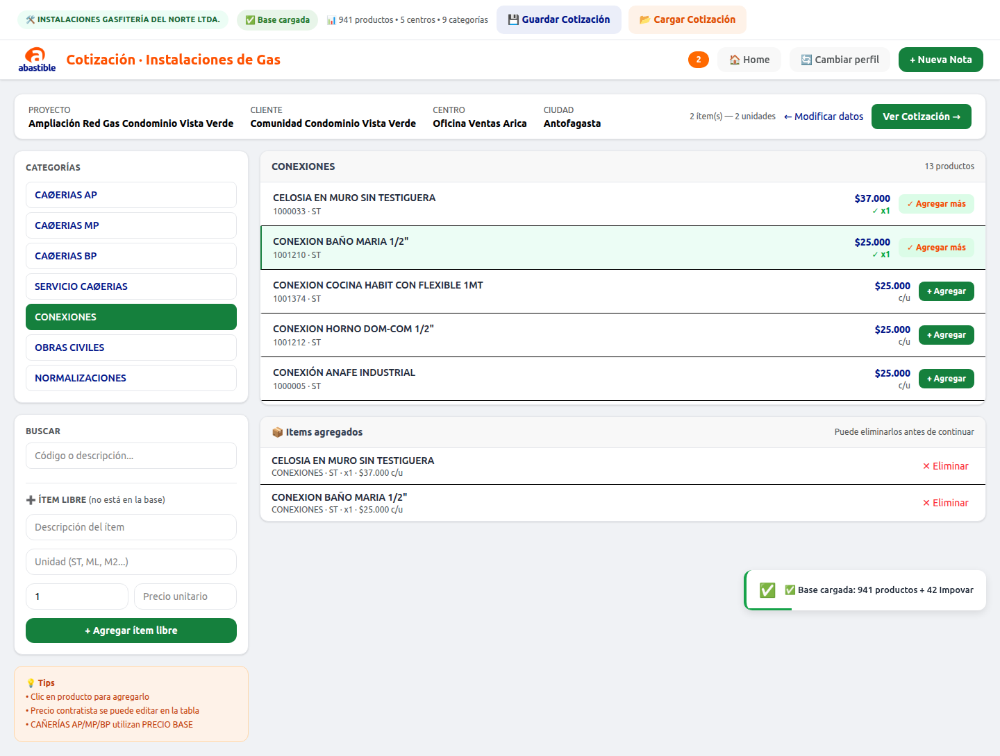
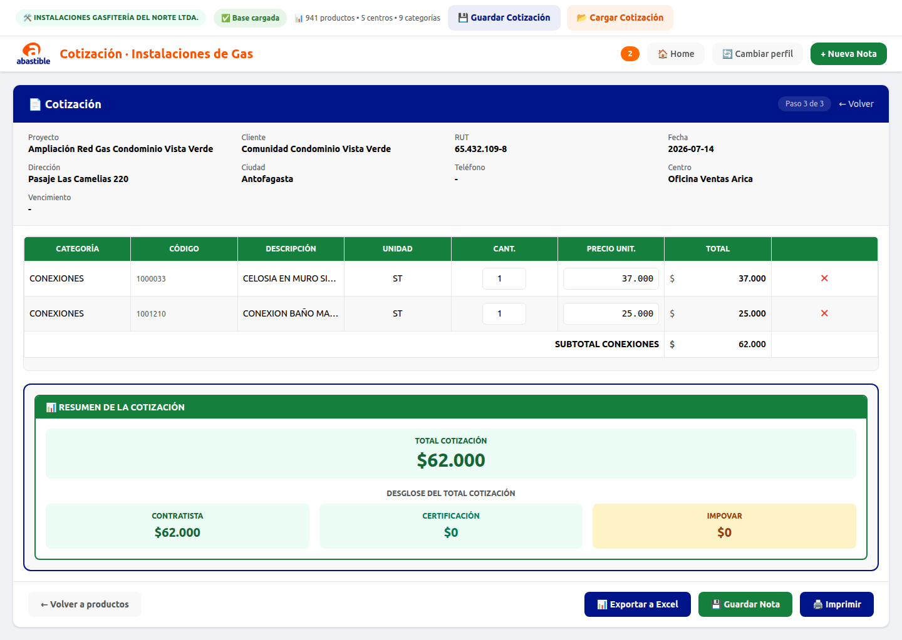
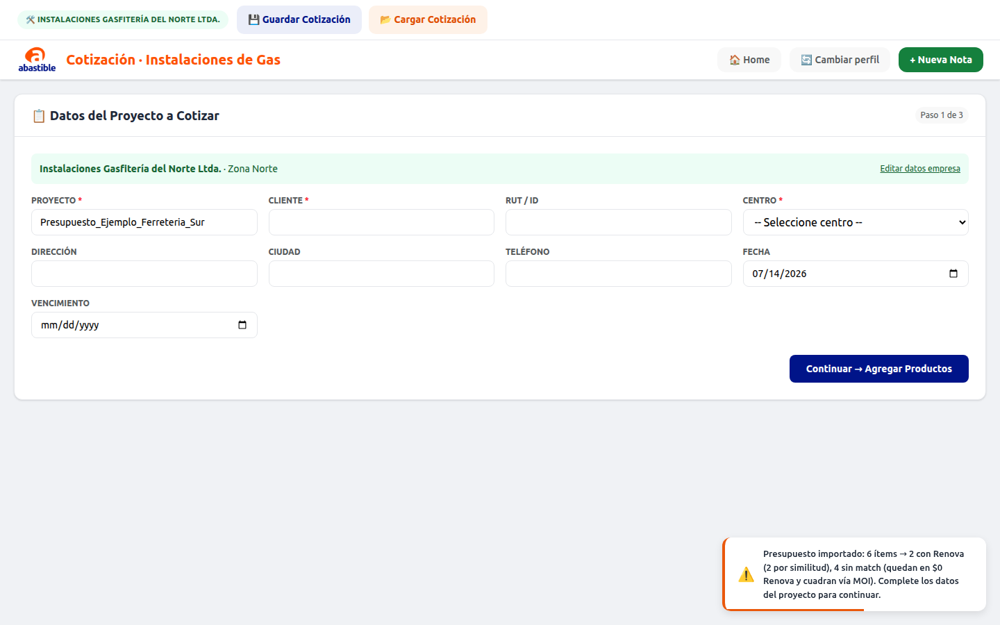
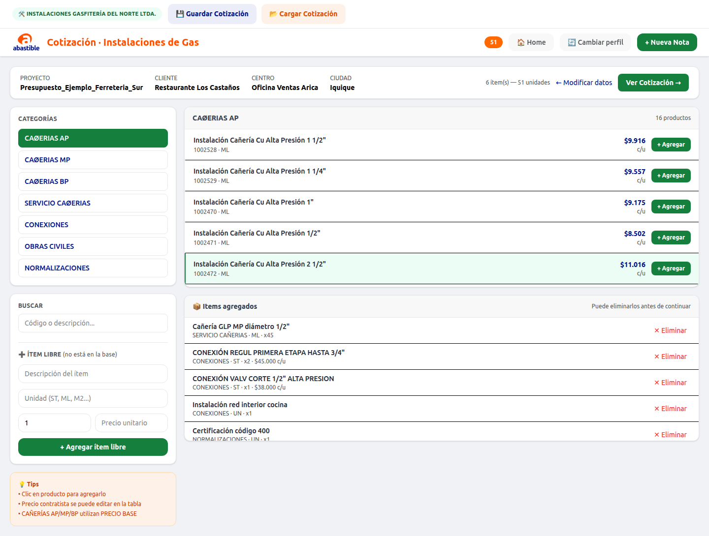
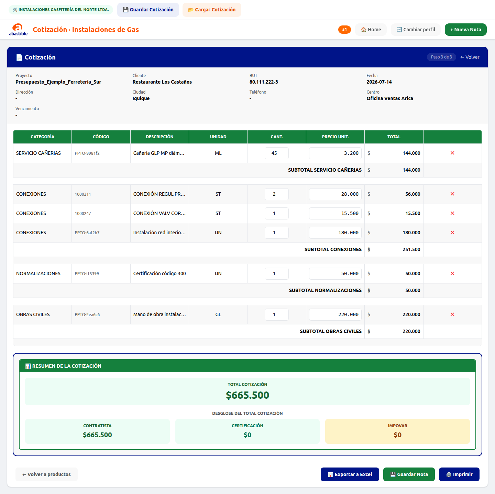

# Manual de usuario — Perfil Contratista

> Guía paso a paso de la app **Nota de Venta Abastible** para el perfil **🛠️ Contratista**
> (empresas externas que cotizan instalaciones de gas). Todas las capturas de este
> manual son de la app real, usando datos de ejemplo ficticios.

Si sos personal de **Abastible**, usá [MANUAL_ABASTIBLE.md](MANUAL_ABASTIBLE.md) en su lugar.

## Índice

1. [Ingreso y datos de la empresa](#1-ingreso-y-datos-de-la-empresa)
2. [Elegir cómo cotizar](#2-elegir-cómo-cotizar)
3. [Cotización Libre](#3-cotización-libre)
4. [Cotizar sobre DC](#4-cotizar-sobre-dc)
5. [Convertir Ppto. a Cotización](#5-convertir-ppto-a-cotización)
6. [Guardar y cargar tu cotización](#6-guardar-y-cargar-tu-cotización)
7. [Acciones del documento final](#7-acciones-del-documento-final)
8. [Preguntas frecuentes](#8-preguntas-frecuentes)

---

## 1. Ingreso y datos de la empresa

Al abrir la app, seleccioná **🛠️ Contratista**.

A diferencia del perfil Abastible, acá se abre primero un modal pidiendo los datos de
tu empresa — aparecen en la Cotización que generes:

- **Razón Social** y **RUT Empresa** son obligatorios.
- **Zona** es obligatoria (Norte / Centro / Agroindustrial / Sur / Austral): define qué
  centros y precios Renova vas a ver en el resto de la app. Si tu paquete tiene zona
  fija, este campo ya viene definido y no se pide.
- Representante, Teléfono y Email son opcionales.

Click en **Continuar →**. Estos datos quedan guardados mientras uses la app; se pueden
editar después desde el link **"Editar datos empresa"** que aparece en el Paso 1.

## 2. Elegir cómo cotizar

| Opción | Para qué sirve |
|---|---|
| **📋 Cotización Libre** | Armar la cotización desde cero, eligiendo productos Renova de tu zona y agregando tus propios ítems. |
| **📄 Cotizar sobre DC** | Ya tenés el PDF del Detalle Comercial que te mandó Abastible: se importan los ítems solos y vos completás tus precios. |
| **📊 Convertir Ppto. a Cotización** | Ya armaste tu presupuesto en tu propio Excel: lo subís y la app lo convierte, vinculando precios Renova y material Impovar. |

## 3. Cotización Libre

### 3.1 Paso 1 — Datos del proyecto

La base de productos de tu zona se carga sola. Arriba aparece un banner con el nombre
de tu empresa y tu zona (con link para editar los datos si hace falta).

Completá **Proyecto**, **Cliente** y **Centro** (obligatorios) y el resto de los datos
que correspondan, luego **Continuar → Agregar Productos**.

### 3.2 Paso 2 — Agregar productos

Igual que en el perfil Abastible: categorías a la izquierda, productos de tu zona a la
derecha, buscador y opción de agregar **ítem libre** (no está en la base).

El **precio unitario es editable en la tabla de ítems agregados** — ahí es donde
ingresás tu precio de venta para cada ítem.

Click en **Ver Cotización →**.

### 3.3 Paso 3 — Cotización final

Se ve el detalle por categoría (Unidad, Cantidad, Precio Unit., Total) y el resumen con
el total de tu cotización — acá no aparece la comparativa contra Renova ni el MOI, esa
parte la ve solo Abastible en su análisis.

## 4. Cotizar sobre DC

Cuando Abastible ya te mandó el **PDF del Detalle Comercial**:

1. Elegir la tarjeta **📄 Cotizar sobre DC** — se abre el explorador de archivos
   automáticamente.
2. Seleccionar el PDF. La app lo analiza con IA (puede tardar hasta 1-2 minutos) y
   extrae proyecto, cliente, ítems y precios Renova.
3. Confirmar la carga: los ítems quedan importados en el Paso 2, listos para que
   agregues tus precios.
4. Continuar hasta el Paso 3, donde vas a ver la comparativa de tu precio contra el
   precio Renova de cada ítem.

## 5. Convertir Ppto. a Cotización

Si ya armaste tu presupuesto en tu propio Excel (con tu propio formato de columnas:
como mínimo **Descripción**, **Cantidad** y **Precio**), esta opción lo convierte
directo a Cotización:

1. Elegir la tarjeta **📊 Convertir Ppto. a Cotización** y seleccionar el Excel.
2. La app matchea cada ítem contra los productos Renova de tu zona (cañerías por
   diámetro + presión, el resto por descripción exacta o similar) y vincula el
   material Impovar de las instalaciones de cañería automáticamente.
3. Si falta Proyecto, Cliente o Centro, se piden antes de continuar (el nombre de
   Proyecto se propone solo a partir del nombre del archivo):

   

4. Se abre el Paso 2 con tus ítems ya importados y tus precios cargados — se pueden
   revisar y ajustar antes de continuar:

   

5. Al llegar al Paso 3 ves tu Cotización ya armada, con tus propios precios (los ítems
   que no matchearon con Renova quedan igual, con el precio que traía tu Excel):

   

## 6. Guardar y cargar tu cotización

A diferencia de Abastible (que tiene Historial con respaldo en la nube), el Contratista
guarda y retoma su trabajo con un archivo **`.json`** local, disponible en la barra
superior en cualquier momento de la cotización:

- **💾 Guardar Cotización** — descarga `NV_<proyecto>.json` con todos los datos del
  proyecto y los ítems. Es el mismo archivo que se manda a Abastible para que lo abra
  con **"Abrir cotización del contratista"** en su Análisis DC + Cotización.
- **📂 Cargar Cotización** — vuelve a abrir un `.json` guardado antes (propio, o uno
  que te mandó Abastible con **Enviar a Contratista**) para completar tus precios y
  seguir donde quedaste.

## 7. Acciones del documento final

Al pie del Paso 3:

- **📊 Exportar a Excel** — descarga tu cotización en Excel: si es una cotización
  propia, con columnas Categoría/Código/Descripción/Unidad/Cant./Precio Unit./Total
  más tus datos de empresa; si estás cotizando sobre un proyecto cargado desde
  Abastible, incluye además la comparativa contra el precio Renova.
- **💾 Guardar Nota** — guarda una copia local en este navegador (además del `.json`
  de la [sección 6](#6-guardar-y-cargar-tu-cotización), que es la forma recomendada de
  compartir tu cotización con Abastible).
- **🖨️ Imprimir** — imprime el documento tal como se ve en pantalla.

El Contratista no tiene acceso a **Generar DC** ni a **Historial**: esas funciones son
exclusivas del perfil Abastible.

## 8. Preguntas frecuentes

**¿Por qué mi selector de Centro está vacío o no encuentro mi zona?**
Los centros dependen de la Zona elegida al ingresar tus datos de empresa. Si creés que
falta tu centro, contactá a Abastible — puede ser que la base de productos todavía no
tenga cargada tu zona.

**¿Cómo le mando mi cotización a Abastible?**
Con **💾 Guardar Cotización** (barra superior), que descarga un `.json`. Se lo mandás
por el canal que uses habitualmente (correo, etc.) y Abastible lo abre desde su perfil
con "Abrir cotización del contratista".

**Subí mi Excel de presupuesto y algunos ítems no matchearon con Renova, ¿está mal?**
No necesariamente: si tu Excel usa descripciones muy distintas a las de Renova, esos
ítems quedan como ítem libre con tu propio precio. Podés revisarlos y corregirlos en el
Paso 2 antes de continuar.
